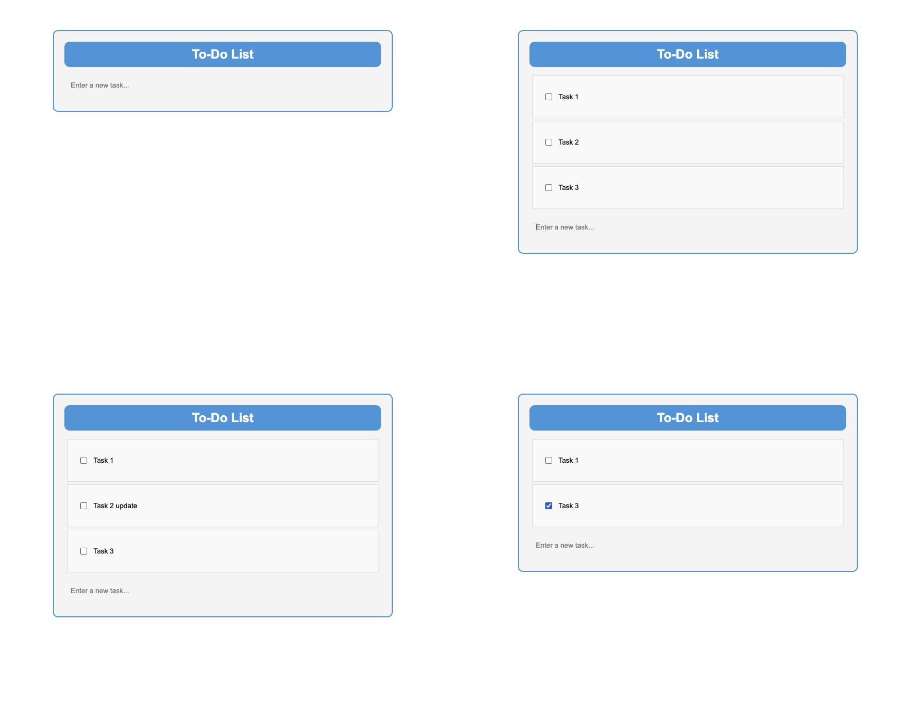

# To-Do App

A simple To-Do application built with FastAPI, HTML, CSS, and JavaScript.



## Table of Contents

- [Introduction](#introduction)
- [Features](#features)
- [Getting Started](#getting-started)
  - [Prerequisites](#prerequisites)
  - [Installation](#installation)
  - [Running the App](#running-the-app)
- [Usage](#usage)
- [Contributing](#contributing)
- [Contact](#contact)

## Introduction

Our To-Do app provides easy-to-use task organization. To easily create, update, and delete tasks, use the API. The straightforward architecture guarantees hassle-free control, simplifying organization for both users and developers.

## Features

- Task Creation: With an intuitive interface, add new tasks quickly.

- Task Update: Easily adjust the specifics of a task when priorities or statuses shift.

- Task Deletion: Easily remove tasks that are finished or no longer relevant.

- API Integration: Use the API to easily integrate it with other programs.

## Getting Started

### Prerequisites

List of things you need to use the software and how to install them.

- Python 3.8 or higher
- FastAPI
- Uvicorn
- JavaScript
- HTML
- CSS


### Installation

Provide step-by-step instructions to install the software.

```bash
git clone https://github.com/JeanMichelBB/ToDoListAPI.git
cd ToDoListAPI
```

Install Dependencies:

```bash
pip install -r requirements.txt
```

Run the FastAPI App:
```
uvicorn main:app --reload
```

## contact
- Linkedin: [JeanMichelBB](https://www.linkedin.com/in/jeanmichelbb/)
- Github: [JeanMichelBB](https://github.com/JeanMichelBB)
- My Website: [jeanmichelbb.github.io](https://jeanmichelbb.github.io/)

